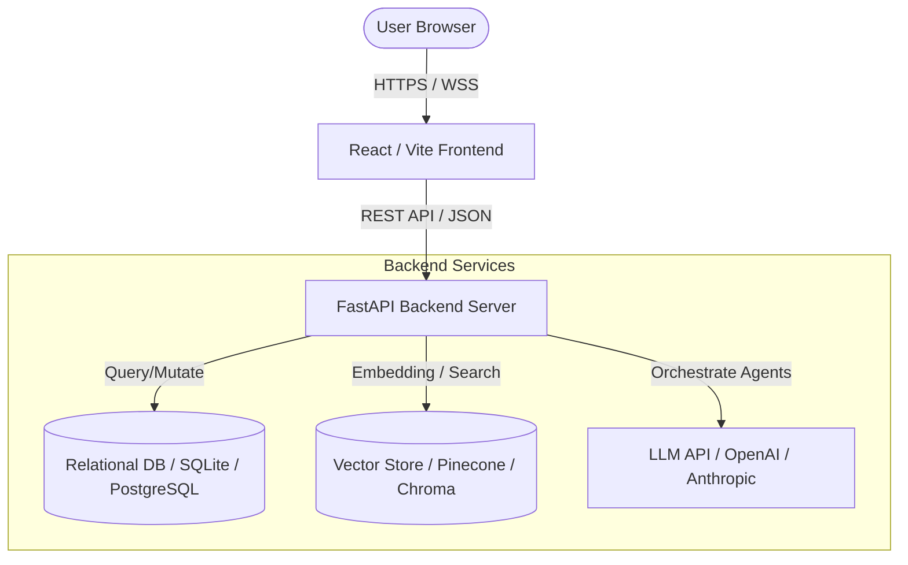

# System Architecture

This document describes the high-level architecture of CareerPilot AI, outlining the components, data flow, and interactions between systems.

## 1. High-Level Architecture Diagram

## 2. Core Components

- **Frontend**: A React single-page application built with TypeScript, Vite, TailwindCSS, and Framer Motion. Configured to communicate with the Backend API.
- **Backend (FastAPI)**: Serves REST endpoints for authentication, profile management, and AI actions. Houses the background task processors and agent workflows.
- **Database**: Stores relational data such as user accounts, resumes, chat histories, and job search records.
- **Vector Store**: Indexes embedded representations of job profiles, resume chunks, and knowledge base docs to facilitate fast semantic retrieval (RAG).
- **AI Agent Workspace**: Utilizes LLMs with custom prompt designs to conduct resume analysis, interview coaching, and career roadmap generation.

## 3. Data Flow (Resume Analysis Example)

1. User uploads a PDF/Word resume in the React Frontend.
2. Frontend sends the file payload to the FastAPI `/api/v1/resume/analyze` endpoint.
3. Backend extracts the text content and splits it into semantic chunks.
4. Chunks are sent to the Embedding API to generate vector embeddings.
5. The LLM Agent processes the resume text alongside target job descriptions, executing analysis prompts.
6. The compiled score, feedback, and job matching metrics are returned to the user in a JSON payload.
